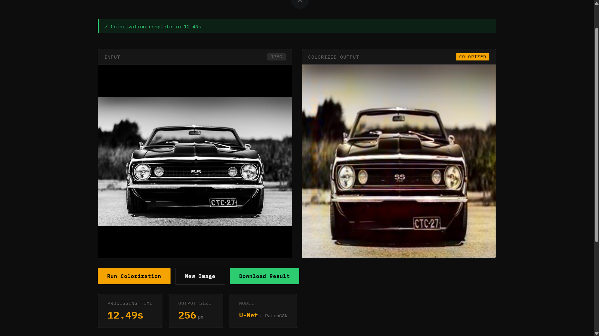

# ColorGAN: AI-Powered Image Colorization Using Conditional GANs

## Overview

ColorGAN is a deep learning-based image colorization system that automatically transforms grayscale images into realistic colorized outputs using Conditional Generative Adversarial Networks (cGANs). The project leverages a U-Net Generator and PatchGAN Discriminator architecture trained in the LAB color space to predict chrominance information from grayscale images.

The system includes a Flask backend for model inference and a React-based frontend that enables users to upload grayscale images and receive colorized results through an interactive web interface.

---

## Live Demo

**Frontend:**
https://YOUR-VERCEL-URL.vercel.app

**Backend API:**
https://colorgan-ai-image-colorization-production.up.railway.app

---

## Application Preview



The web interface allows users to upload grayscale images, generate colorized outputs using a Conditional GAN model, compare results visually, and download the generated image.

---

## Features

* Conditional GAN-based image colorization
* U-Net Generator architecture with skip connections
* PatchGAN Discriminator for adversarial training
* LAB color space processing
* Mixed Precision (AMP) training
* Real-time inference using Flask API
* Modern React frontend
* Drag-and-drop image upload
* Side-by-side image comparison
* Downloadable colorized outputs
* Training metrics tracking and evaluation
* Cloud deployment using Railway and Vercel

---

## Architecture

```text
Grayscale Image
        │
        ▼
   LAB Conversion
        │
        ▼
      L Channel
        │
        ▼
  U-Net Generator
        │
        ▼
 Predicted AB Channels
        │
        ▼
    LAB Fusion
     (L + AB)
        │
        ▼
   RGB Conversion
        │
        ▼
 Colorized Output
```

### Generator

* U-Net Encoder-Decoder Architecture
* Skip Connections
* Batch Normalization
* ReLU / LeakyReLU Activations
* Tanh Output Layer

### Discriminator

* PatchGAN Architecture
* Local Patch Classification
* Adversarial Learning
* BCEWithLogitsLoss

---

## Technology Stack

### Deep Learning

* PyTorch
* TorchVision
* NumPy
* OpenCV
* Pillow
* scikit-image

### Backend

* Flask
* Flask-CORS

### Frontend

* React
* Vite
* JavaScript
* CSS

### Deployment

| Service         | Platform |
| --------------- | -------- |
| Frontend        | Vercel   |
| Backend         | Railway  |
| Model Inference | PyTorch  |
| API             | Flask    |

---

## Project Structure

```text
ColorGAN-AI-Image-Colorization/
│
├── backend/
│   └── app.py
│
├── frontend/
│   ├── src/
│   ├── public/
│   ├── package.json
│   └── vite.config.js
│
├── models/
│   ├── dataset.py
│   ├── generator.py
│   ├── discriminator.py
│   ├── train.py
│   └── inference.py
│
├── results/
│   └── train_history.json
│
├── screenshots/
│   └── colorgan-dashboard.png
│
├── requirements.txt
└── README.md
```

---

## Training Configuration

| Parameter       | Value     |
| --------------- | --------- |
| Generator       | U-Net     |
| Discriminator   | PatchGAN  |
| Image Size      | 256 × 256 |
| Color Space     | LAB       |
| Batch Size      | 4         |
| Optimizer       | Adam      |
| Learning Rate   | 0.0002    |
| Mixed Precision | Enabled   |
| Epochs          | 50        |

---

## Results

| Metric | Score    |
| ------ | -------- |
| PSNR   | 25.64 dB |
| SSIM   | 0.90     |

The trained Conditional GAN successfully reconstructs plausible color information from grayscale inputs while preserving image structure and semantic consistency. The model demonstrates strong perceptual quality on unseen test images and achieves competitive PSNR and SSIM scores.

---

## Installation

### Clone Repository

```bash
git clone https://github.com/AnkitBind21/ColorGAN-AI-Image-Colorization.git

cd ColorGAN-AI-Image-Colorization
```

### Install Backend Dependencies

```bash
pip install -r requirements.txt
```

### Install Frontend Dependencies

```bash
cd frontend

npm install
```

---

## Running the Application

### Start Flask Backend

```bash
python backend/app.py
```

Backend runs on:

```text
http://localhost:5000
```

### Start React Frontend

```bash
cd frontend

npm run dev
```

Frontend runs on:

```text
http://localhost:5173
```

---

## Model Inference

```bash
python models/inference.py \
  --checkpoint checkpoints/generator_latest.pt \
  --input path/to/image.jpg \
  --output result.jpg
```

---

## Future Improvements

* Larger training datasets
* Attention-based generators
* Diffusion-based colorization models
* Mobile deployment
* Cloud inference API
* Video colorization support
* Multi-style colorization modes
* Historical photo restoration

---

## Author

**Ankit Bind**

B.Sc. Information Technology
Mumbai University

Machine Learning • Deep Learning • Computer Vision • Artificial Intelligence

---

## License

This project is intended for academic, educational, and research purposes.
